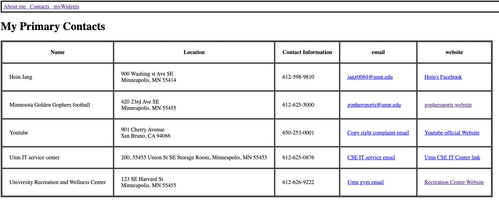

# Homework 1 (HTML,CSS)

## 1. About me
    The first page of MyAboutMe contains my name, a picture, and a short bit of text about myself. The page has a title and a picture representing myself

Figure1 "myAboutMe.html 

## 2. myContacts
    This page contains a table and columns.
    I have used the table tag as tr,td the, and so on.
    The table has the following columns:

    1. The name of the contact
    2. Location/street address of the contact
    3. Information about the contact
    4. The contact's email address
    5. A link to the homepage for the contact information.

Figure2 "myContacts.html"

## 3. myWidget
    These widget pages have two core skills, such as practicing HTML list and embedding content from social media services(Youtube, Twitter)

Figure3 "myWidgets.html"
 
Figure4 "myWidgets.html"  

