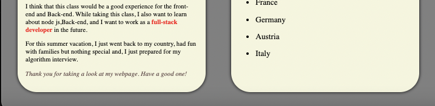
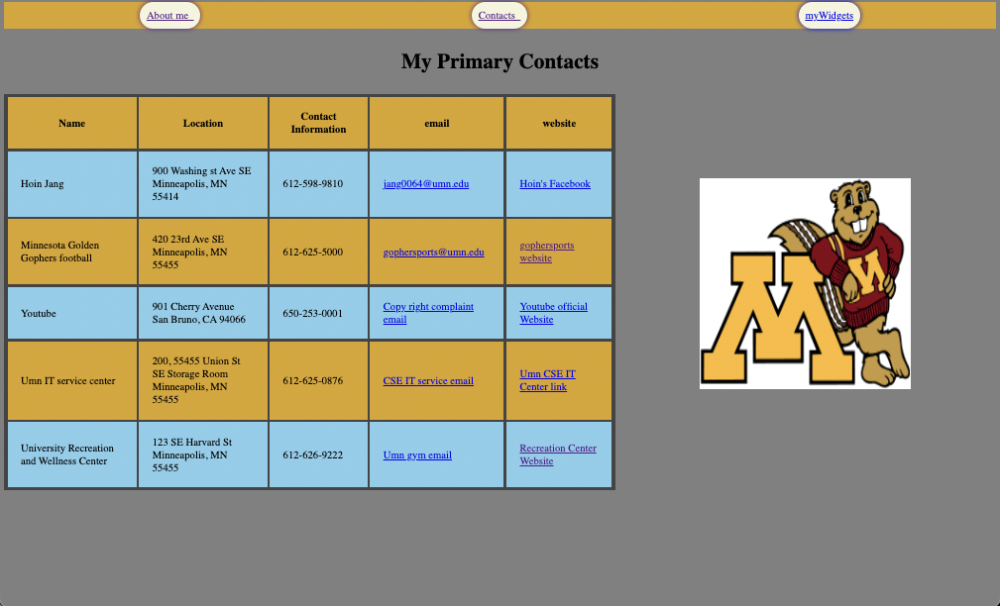
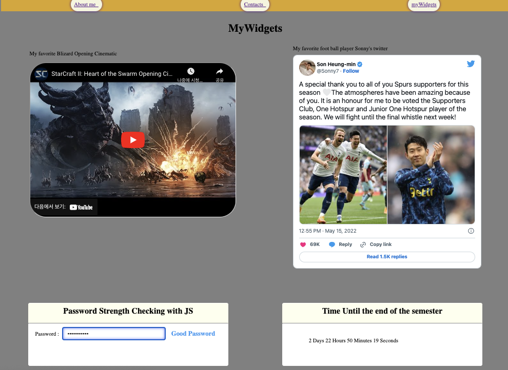

# Homework2 (HTML,CSS,JAVASCRIPT) 

## 1. About me
    Some updates from Homework1 there is a large amount of CSS improvement.

    I have used google font style. At the top of the page. Put the hover when the user mouse over the navigation bar.

Figure1: "myAboutMe.html"

## 2. myContacts
    When the user mouse over the location from a specific name, it shows a picture of the place. And if the user does not mouse over then, show Gopher. Moreover, I gave the colors for the table odd/even for each row.
Figure2: "myContact.html"

## 3. myWidgets (Widget page Additions)
    1. Time Left Widget
    2. Password Strength Checker Widget

    Time Left Widget is showing how many days, hours, minutes, and seconds are left in the Fall 2022 semester. From here, the most important part is using the new Date() function and Math. floor for calculating it.

    For the Password Strength Checker, I have used Regular Expressions and it checks 4 different types of password
    "Short", "Weak Password", "Good Password", and "Strong Password". It depends on how the user type 
    ----------------------------------------
    | Score | Class Name | Message         |
    |-------+------------+-----------------|
    | s < 2 | weak       | Weak Password   |
    | s = 2 | good       | Good Password   |
    | s > 2 | strong     | Strong Password |
    ---------------------------------------
Figure3: "myWidget.html"

