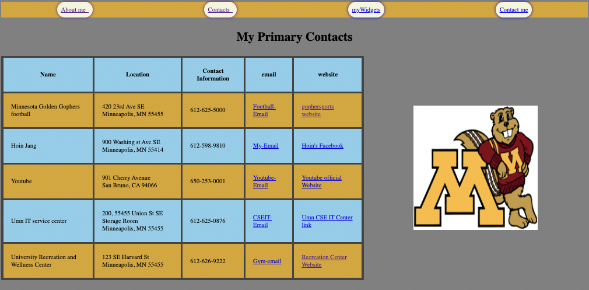
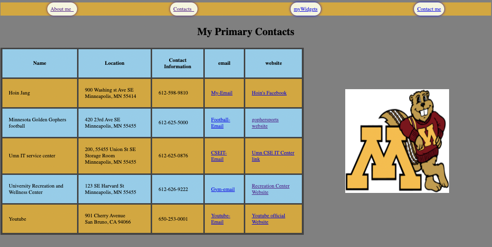
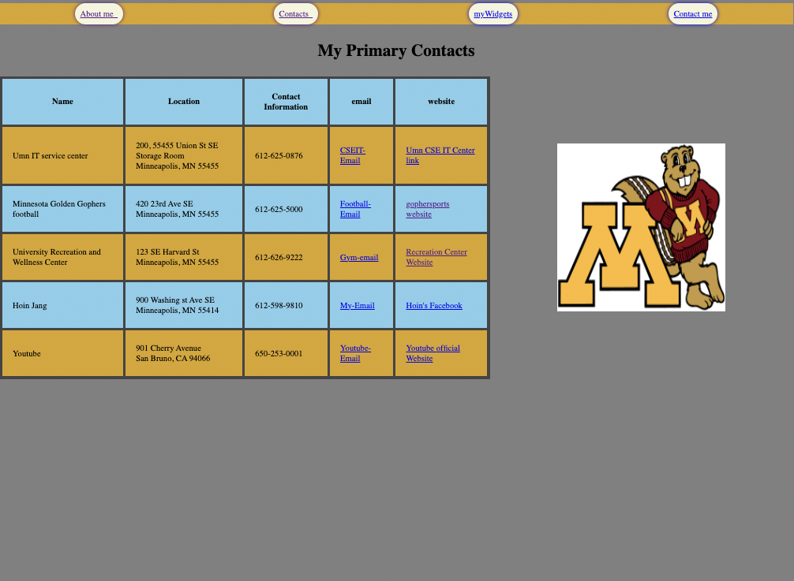
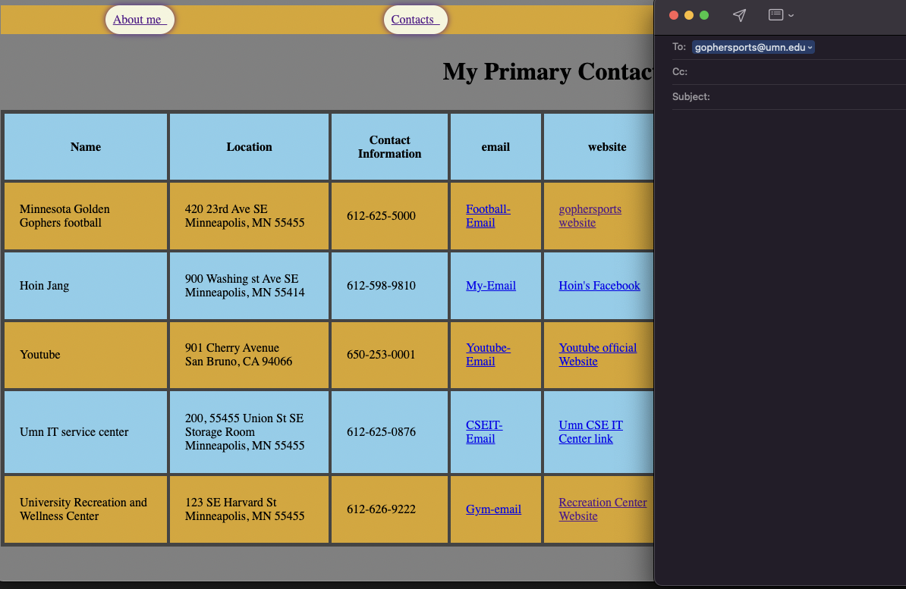
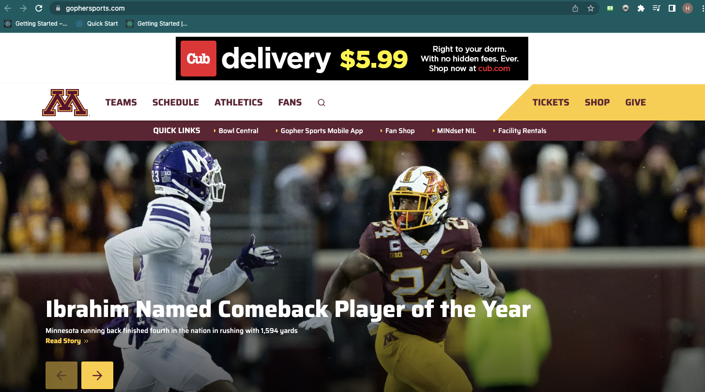
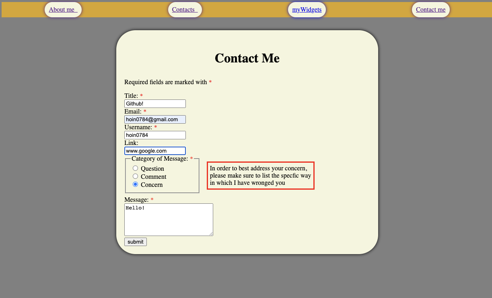
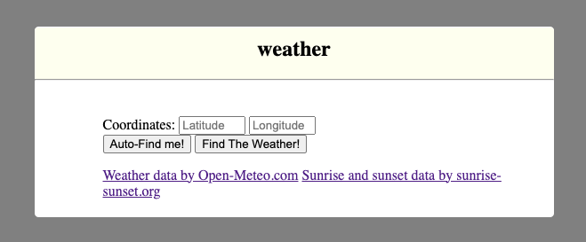
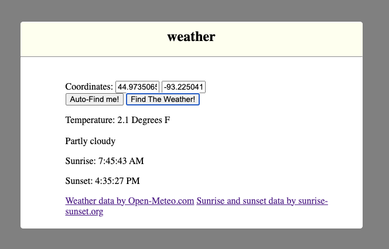

# Homework3 (HTML,CSS,JAVASCRIPT)

## 1.About me (no change)

## 2.MyContacts(Contacts form Sorting)
    For sorting the name and email Alphabet order, I used javascript.
    Mostly in this part, it needs to use the DOM manipulation and cells[i] control for innerText (such as document.getElementById, innerText comparing, appendChild.

    Moreover, You can send mail by clicking on the articles displayed under the mail, and the articles displayed under the website are also linked to the corresponding link.

Figure1: Before the user click the Name header button

Figure2: After the user click the Name header button

Figure 3: After the user click the email header button (it flows from Figure 1 -> Figure 3 here).

Figure 4: When the user clicked email of Football-Email

Figure 5: When the user clicked website of Football-Email

## 3.ContactMe form (used post method)
    1.Feature 1: auto-suggest username
    2.Feature 2: clarification box

    When the user is typing the Email and put @ then, the Username is automatically suggested. ex) If I type in hoin0784@gmail.com as my email and have not filled in a username, hoin0784 should populated the email field. But, this should not happen if there is already a username entered.
    And it is repeatable, so if I fill in the email it should fill in a username,

    For the clarification box, Whenever the user indicates the category of Message as Concern, a message is shown in a read box somewhere on the screen. (I used .style.visibility = "visible")

Figure 6: Contact Me form

## 4. myWidgets (Open-meteo API)
    From widgets, the only change is the weather widget. This widget automatically finds the user's location. It shows the sunset-sunrise of the user's place, Temperature, and Weather. I used "https://sunrise-sunset.org/api" API endpoints and fetch() for connecting after that read JSON to pull out data(sunset-sunrise API returns JSON). Since the API return times are in standard ISO 8601 format, it is needed to use the new Date() and tocaleTimestring function.

    -new Date(String) will decode a string in many standard formats including ISO8601

    -date.toLocaleTimeString() will create a readable string in the local time zone for the time indicatd by a date object

Figure 7: Before the user click Auto-Find me!

Figure 8: when the user clicked Find The Weather!

