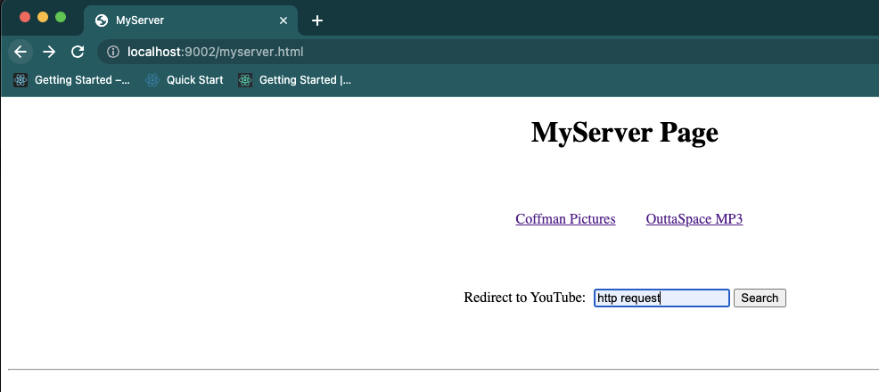

# Homework4 (HTTP Requests & Responses with python)

## 1. MyServer
    The objective of this assignment is to learn about the Hyper-Text Transfer Protocol(HTTP) and build a small subset of an HTTP server in Python. Using Python 3 and TCP sockets.

    1.Basic get requests
    2.redirect url
    3.private.html authorization workflow

    I have used ports 9001 and 9002(since the address 9001 is in use). 
    To execute the file, type the command: python3 myserver.py 

Figure 1: A 404 error should be returned if the path provided is not found.
such as no slash after the port number.

Figure 2: <b>(private.html)</b>. check if the client used the appropriate header to send along credentials (username and password) for this resource.

Figure 3: If the username and password are correct (username: <b>admin</b> password: <b>password</b> ), then the file <b>private.html</b> should be returned.

Figure4: Example of 401.html being returned by the server. If the username and password are incorrect, sent incorrectly, or not sent at all, then a 401 response should be sent, along with the content of the file <b>401.html</b>

Figure 5: In <b>MyServer.html</b> is a <b>form </b> which when submitted sends a request to the <b>/redirect</b> path. This server should be able to accept this GET request and then redirect the client to the YouTube search results page where the user's input is already entered for them by using a temporary redirect.

Figure:6 When the user clicked the Coffman pictures link.

Figure:7 When the user clicked the OuttaSpace MP3.

Figure:8 Before the user clicks the Search button with HTTP request search.

Figure 9: After the user clicked the Search button, it redirects to the HTTP request Youtube search video. This is an example of the server handling a redirect request.

