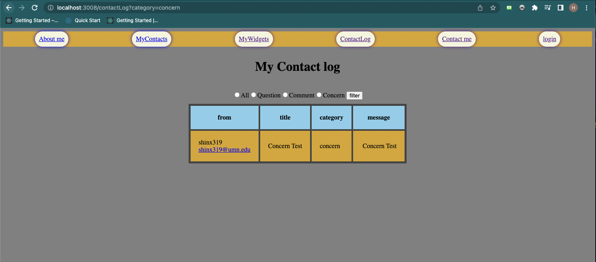

# Homework 5 (Express JS with pug templating engine)
    The objective of this assignment is to demonstrate a mastery over various features of the Express framework with PUG templating

    In this homework, I have added:
    1. login feature (express-session)
    2. click count (fetch)
    3. contact form updates(DB)
    4. contact log page(DB)

    Each of my major pages (myAboutMe,myContacts, contactMe, myWidgets) is converted to PUG.

    To execute the files, I need to use cselab machine to set up the database(MySQL)
    If you look at the package JSON I have downloaded:
        1. express
        2. express-session
        3. MySQL
        4. pug
        5. nodemon

## 1.Login Feature

   To start the server, 
    
    Type: nodemon server.js 

    For this feautre I shoud:
        1. Setup my server for sessions
        2. Add new pages, pug files, etc. for handling log-in and log-out behaviors
        3. update the old pug file, and all old request handlers to make the username appear on all pages
    
    The login page should be accessible by a GET request to URL /login
    The major point of the login feature is that takes the username and stores it on the session object so that the username is remembered for the rest of the user's browser session.

    If the user visits /login while logged in, a welcome message should be shown, and a logout button offered. If the user pressed the logout button they should be logged out and redirected to the aboutMe page

Figure1: When the user request localhost:3006/login

Figure 2: After logging in, it redirects to the AboutMe page and the login navigation is changed to the username.

Figure 3: When the user visits the /login page again, the logout page is shown and after clicking the logout, it redirects to Figure 2 again without the username.

## 2. New Widget
    The goal of this widget is to count how many times it's been clicked across multiple open tabs/pages

    For this step I should begin by adding the following:
    1. A global variable

    2. POST/API/click (This should increment the click count, and return its new value in JSON)

    3. GET/API/click This should not increment the click count but should return its value in JSON

    The JSON return should be a simple object with a single property "clickCount"

Figure 4: I opened two tabs, click up the click count and see it increasing(on about a second delay) on the other tab.
                                   

## 3. Contact message database
    Filling out the form and submitting it should bring you back to the contactMe page, but with a message to confirm the post was received. The form is connected with the contact log part.
    
    1. Get the form values out of the POST body.
    2. attempt to create a new row in my SQL database.
    3. If there is an error, it should render the contactMe page with the error message.
    4. If the data is added successfully, the conactMe page should be rendered

Figure 5: When the form is submitted successfully without duplicating the username

Figure 6: When the form returned to fail since the DB catch the same username. 
I have set the username as the primary key

## 4. Contact log page
    The contact log page, involves a new pug file contactLog.pug, a new menu item in the nav bar, and a handler for GET requests to /contactLog. Figure 6 is showing that the database is empty and shows an error message and does not show the table.

    Moreover, when the user clicks All, Question, Comment, Concern, and then clicks the filter button, users can check only the message of the desired form.

    Lastly, if in contact me, the user provides the URL(Link) - the username should link to the URL, which is user typed. And under the username, the provided email should be shown, and this should be a mailto link, which mails to the provided email.

Figure 7: Since the no form is submitted, it is showing "No message found!"

Figure 8: When the user form submitted a form from the contact me and take the data to the contact log.

Figure 9: After submitting a few more forms.

Figure 10: when the user clicked the Concern button with filter.

Figure 11: when the user clicked the Comment button with filter.

Figure 12: User provides the URL(Link) in the contact me form. - the username name link to the URL. I have linked to google search!

Figure 13: Mailto link, which the user provided in the contact form.

